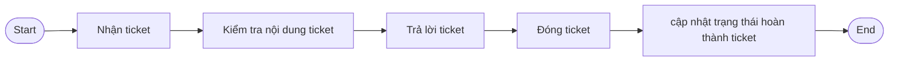
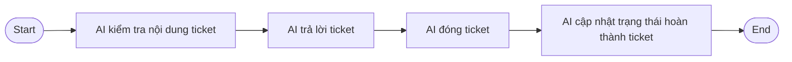
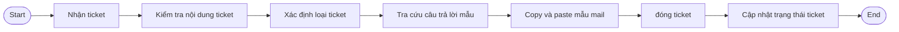
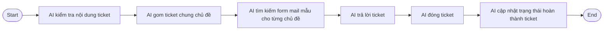
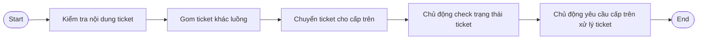
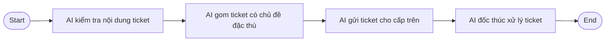

Case: Tôi từng làm trong bộ phận hỗ trợ xử lý các khiếu nại thông qua hệ thống ticket nội bộ của công ty. Hàng ngày sẽ tiếp nhận các ticket và gửi mail trả lời cho khách hàng hoặc nhân viên đã tạo ticket qua mail các ticket. Các ticket giống nhau chiếm số lượng rất lớn. Nên việc trả lời các ticket này hàng ngày tốn rất  nhiều thời gian. Các ticket đặc thù hoặc phổ biến có form mail mẫu để copy paste gửi cho nhanh qua một gg sheet. Các ticket đặc biệt hoặc không có form mẫu trả lời sẵn được chuyển cho cấp trên có liên quan trực tiếp trả lời và phải chủ động kiểm tra tiến độ và báo lại nếu cấp trên vẫn chưa giải quyết. 

# 01 — Individual Problem Scan

## Scan rộng

| # | Lăng kính | Problem quan sát được | Ai chịu ảnh hưởng? | Dấu hiệu thật |
|---|---|---|---|---|
|1|Lặp lại|Lặp lại trả lời các ticket có chủ đề giống và khác nhau|Nhân viên Help desk|Nhân viên trả lời từng ticket một|
|2|Lặp lại|Nhân viên tra form trả lời mẫu rồi copy paste để gửi lại mail trả lời ticket|nhân viên help desk|lặp lại mỗi ticket|
|3|Ai có thể tốt hơn|Copy nhầm form mail trả lời mẫu|Khác hàng|Copy nhầm cột nhầm ô chứa form mail mẫu|
|4|Mất thời gian|Nhân viên tự gửi lại các case ngoài phạm vi lại cho cấp trên|nhân viên help desk, quản lý|ticket bị dồn 3-4 ngày mới được trả lời|
|5||Mất thời gian, lặp lại|nhân viên help desk chủ động kiểm tra tiến độ các ticket ngoài phạm vi trả lời và nhắc cấp trên hoàn thành, chậm tiến độ bị đánh giá phản hồi chậm|nhân viên help desk, quản lý|

## Top 3

| Rank | Problem | Vì sao chọn |
|---|---|---|
|1|Nhân viên trả lời từng ticket một|Có workflow rõ ràng, lặp lại|
|2|Lặp lại đối chiếu và copy paste để trả lời từng ticket|Có workflow rõ ràng, lặp lại|
|3|Lặp lại|thống kê các ticket ngoài phạm vi trả lời|Lặp lại, mất thời gian|

## Problem Card #1 — Ticket handle

**Problem 1 câu:**  
Nhân viên kiểm tra nội dung từng ticket rồi trả lời lại ticket đó sau đó cập nhật trạng thái đã xử lý với ticket 

**Actor:**
Nhân viên helpdesk

**Current workflow:** 

**Bottleneck:**  
Lặp đi lặp lại mở ticket, trả lời ticket, đóng ticket và cập nhật trạng thái ticket 

**Impact:**
Tăng thời gian xử lý ticket giảm năng suất helpdesk 

**Success metric:**
Giảm số lượng người xử lý ticket cần cho mỗi ngày 

**Non AI Alternative:**
Chuẩn hóa câu trả lời, tối ưu hệ thống ticket, hệ thống có câu trả lời mẫu sẵn để chọn thay vì chuyển qua tab lưu trữ câu trả lời

**AI hypothesis:**
AI đọc nội dung ticket, phân loại tự, sinh câu trả lời và tự động cập nhật trạng thái ticket, AI trả lời hàng loạt ticket chung chủ đề. 

**Quick gut:**
Ai agent

### Draft future workflow

## Problem Card #2 — Mail form 

**Problem 1 câu:**  
Nhân viên kiểm tra nội dung ticket xác định loại ticket tra cứu với kho mail trả lời mẫu paste lên rồi gửi đi và hoàn thành ticket

**Actor:**
Nhân viên helpdesk

**Current workflow:** 

**Bottleneck:**  
Lặp đi lặp lại xác định loại ticket tra cứu mail mẫu paste vào để gửi ticket đi

**Impact:**
Tăng thời gian xử lý ticket giảm năng suất helpdesk 

**Success metric:**
Loại bỏ hoàn toàn form trả lời mẫu, giảm số lượng helpdesk để giải quyết

**Non AI Alternative:**
Tối ưu mẫu trả lời sẵn trong hệ thống ticket, nhân viên nhập và tìm kiếm mẫu trả lời theo từ khóa

**AI hypothesis:** 
AI đọc nội dung ticket, tự động phân loại ticket, kiểm tra form mail mẫu tự động trả lời và cập nhật trạng thái ticket, trả lời hàng loạt ticket chung chủ đề.

**Quick gut:** 
AI agent

### Draft future workflow

## Problem Card #3 — Chuyển ticket

**Problem:**
Ticket khác chủ đề sẽ được tổng hợp thủ công lại gửi lại cho cấp trên xử lý, ticket bị pending 3-4 ngày sau mới được giải quyết

**Actor:** 
Khách hàng gửi ticket khi gặp các trường hợp ngoài luồng

**Current workflow:** 

**Bottleneck:**  
Gom ticket thủ công, chủ động check tiến độ và đốc thúc xử lý. 

**Impact:** 
Pending ticket xử lý không kịp thời ảnh hưởng trải nghiệm của khác hàng. 

**Success metric:**
Loại bỏ khâu gom ticket thủ công, loại bỏ khâu check trạng thái kiểm tra ticket và đốc thúc cấp trên.

**Non AI Alternative:**
Đào tạo chuyên viên xử lý case đặc thù thay vì chuyển cho cấp trên chuyên viên này nắm quyền trả lời và xử lý các ticket đặc thù

**AI hypothesis:**
AI đọc nội dung ticket, AI gom ticket đặc thù chuyển cho cấp trên, AI tự động kiểm tra trạng thái và đốc thúc xử lý ticket sớm

**Quick gut** 
AI Agent

### Draft future workflow

